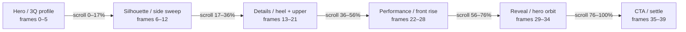
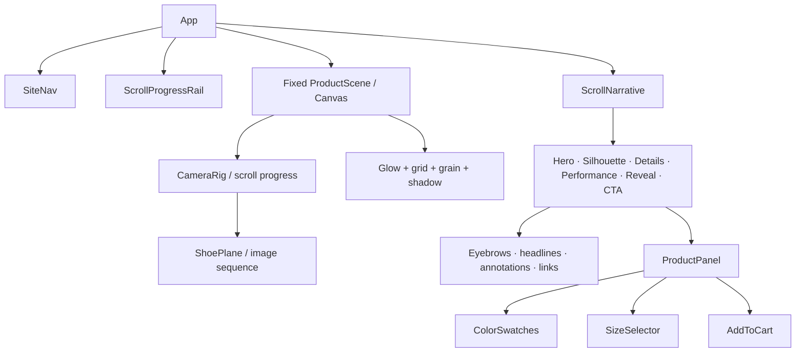

# AERA / 001 — scroll narrative prototype

Standalone concept prototype for a premium running shoe page. Open `index.html` directly or serve this folder with any static server. The 40 supplied images are treated as a single frame sequence: scroll progress selects the nearest frame while the fixed canvas stays behind the copy.

## Motion audit and fix

The original implementation used a fixed-rate `0.11` lerp, assigned `img.src` every rAF tick, created throwaway `Image` objects during preload, and did not wait for decode completion. That made frame selection dependent on display refresh rate and allowed browser decoding to happen while the user was already scrolling. The motion pass keeps one canvas surface, stores decoded `HTMLImageElement` instances in a cache, preloads the first five frames before queueing the remainder, and maintains one time-based animation controller: raw scroll → target progress → damped progress → nearest decoded frame. DOM labels and section focus styles are throttled to meaningful changes. No GSAP, R3F, CSS transition, or second scroll smoother is introduced.

## UI/UX audit before refinement

| Priority | Finding | Correction |
| --- | --- | --- |
| P0 | AERA copy implied ownership of supplied imagery that visibly carries another brand identity. | Reframed AERA as the fictional interface concept and the shoe as a supplied product reference; no new ownership or performance claims added. |
| P0 | Commerce panel showed an invented `$180` price and a decorative cart. | Replaced the price with neutral product-page wording, changed the CTA to the official Nike redirect, and kept the bag as a transparent reference drawer. |
| P1 | Navigation and progress were not semantically synchronized with the active chapter. | Added real section anchors, active nav state, and semantic chapter names: HERO, FORM, DETAIL, RESPONSE, REVEAL, SHOP. |
| P1 | `FRAME 00` exposed implementation noise in the final product experience. | Replaced it with intentional `AERA / 001 · CHAPTER` metadata. |
| P1 | Technical callouts used unverified material/specification language. | Replaced them with neutral labels such as `UPPER / STRUCTURE` and `HEEL / SUPPORT`. |
| P1 | Hero copy could compete with the product silhouette and supporting text could lose contrast over the image. | Added a controlled left-side scrim, text plates, and a clearer primary CTA hierarchy without changing the product image. |
| P2 | Accent lime was applied to most chapter titles. | Replaced it with muted cyan and reserved color accents for active state, CTA, and key metadata. |
| P2 | Keyboard focus and tactile button states were incomplete. | Added visible focus rings and pressed/hover states across links, controls, and bag actions. |

The supplied source frames remain pixel-unchanged. The static release now has dependency-free build/typecheck/lint validation; screenshot comparison and DevTools frame profiling still require a browser test harness for final production handoff.

## Art-direction refinement

- Replaced the lime-led palette with product-derived cyan `#73C9D8`, coral `#F06D45`, charcoal `#111313`, and warm studio neutrals `#F2F1ED` / `#ECEBE7`.
- Added a gradual light product-stage halo through the middle of the scroll story so the bright supplied frames read as an intentional studio environment instead of cards on black.
- Added a bounded decoded-frame cache that retains a nearby ±9-frame window while allowing distant frames to be released during long sessions.
- Reduced accent usage to active states, callouts, chapter metadata, and focused CTAs.
- Added the official product redirect: [View on Nike](https://www.nike.com/launch/t/air-tech-challenge-2-photon-dust-and-dusty-cactus), opening in a new tab with safe external-link attributes.
- The bag remains a transparent reference drawer; it does not claim to process orders or fabricate price, availability, or product facts.

## Conceptual component hierarchy

```text
Static app
├── SiteNav
├── ScrollProgressRail
├── ProductScene (fixed)
│   ├── SceneGlow
│   ├── ShoePlane (image-sequence frame)
│   ├── SceneShadow
│   └── SceneCaption
├── ScrollNarrative
│   ├── HeroSection
│   ├── SilhouetteSection
│   ├── DetailsSection
│   ├── PerformanceSection
│   ├── RevealSection
│   └── CTASection
│       └── ProductPanel (ColorSwatches, SizeSelector, NikeRedirect)
└── SiteFooter
```

## Scroll-frame mapping

| Page Section | Frame Range |
| --- | --- |
| Hero | 0–5 |
| Silhouette | 6–12 |
| Details | 13–21 |
| Performance | 22–28 |
| Reveal | 29–34 |
| CTA | 35–39 |

## Asset manifest

All source files are 1280 × 720 JPG frame captures. The production pipeline should batch-convert them to WebP or AVIF at the same dimensions; the prototype references the provided JPGs directly to keep the supplied pixels unchanged.

| Filename | Size (KB) | Format |
| --- | ---: | --- |
| frame_0.00.jpg | 40 | JPG |
| frame_0.20.jpg | 41 | JPG |
| frame_0.40.jpg | 41 | JPG |
| frame_0.60.jpg | 41 | JPG |
| frame_0.80.jpg | 39 | JPG |
| frame_1.00.jpg | 37 | JPG |
| frame_1.20.jpg | 33 | JPG |
| frame_1.40.jpg | 29 | JPG |
| frame_1.60.jpg | 29 | JPG |
| frame_1.80.jpg | 33 | JPG |
| frame_2.00.jpg | 29 | JPG |
| frame_2.20.jpg | 32 | JPG |
| frame_2.40.jpg | 41 | JPG |
| frame_2.60.jpg | 45 | JPG |
| frame_2.80.jpg | 48 | JPG |
| frame_3.00.jpg | 50 | JPG |
| frame_3.20.jpg | 51 | JPG |
| frame_3.40.jpg | 52 | JPG |
| frame_3.60.jpg | 52 | JPG |
| frame_3.80.jpg | 53 | JPG |
| frame_4.00.jpg | 59 | JPG |
| frame_4.20.jpg | 61 | JPG |
| frame_4.40.jpg | 65 | JPG |
| frame_4.60.jpg | 70 | JPG |
| frame_4.80.jpg | 76 | JPG |
| frame_5.00.jpg | 77 | JPG |
| frame_5.20.jpg | 77 | JPG |
| frame_5.40.jpg | 79 | JPG |
| frame_5.60.jpg | 80 | JPG |
| frame_5.80.jpg | 82 | JPG |
| frame_6.00.jpg | 68 | JPG |
| frame_6.20.jpg | 48 | JPG |
| frame_6.40.jpg | 46 | JPG |
| frame_6.60.jpg | 26 | JPG |
| frame_6.80.jpg | 34 | JPG |
| frame_7.00.jpg | 38 | JPG |
| frame_7.20.jpg | 31 | JPG |
| frame_7.40.jpg | 44 | JPG |
| frame_7.60.jpg | 44 | JPG |
| frame_7.80.jpg | 42 | JPG |

## Milestones

| Task | Days | Owner |
| --- | ---: | --- |
| Frame audit, naming, WebP/AVIF pipeline | 1 | Motion engineer |
| Fixed scene + scroll scrubber | 2 | Frontend engineer |
| Narrative sections + responsive layout | 2 | Product designer |
| Product panel + cart interaction | 1 | Frontend engineer |
| Accessibility, reduced motion, QA | 1 | QA / frontend |

## Camera path diagram



## Component relationship diagram



## Implementation notes

- The canvas is fixed; the document supplies six viewport-height narrative sections.
- `requestAnimationFrame` eases scroll progress toward a target so the frame changes feel continuous rather than jumpy.
- Frame preloading prevents visible gaps after the first scroll input. Production should use an intersection-aware preload budget and AVIF/WebP sources with JPG fallback.
- The shoe is never redrawn, recolored, cropped into cards, or presented as a static gallery tile; it remains the animated scene subject.
- Mobile keeps the same story order, reduces scene effects, widens the plane, and stacks copy/control UI to avoid horizontal overflow.
- `prefers-reduced-motion` disables interpolation and removes nonessential background motion.

## Demo acceptance checklist

- [x] Hero loads with a fixed full-screen scene and real supplied frame.
- [x] Scroll continuously scrubs all 40 real images across Hero, Silhouette, Details, Performance, Reveal, and CTA.
- [x] Product UI is honest: reference color/size selection, transparent bag drawer, official external product CTA, and keyboard-focusable controls.
- [x] Desktop and 390px mobile layouts are included with no horizontal scroll.
- [x] Motion uses opacity/transform and an explicit reduced-motion path.
- [x] Visual states, frame mapping, assets, milestones, component tree, and Mermaid diagrams are documented here.
